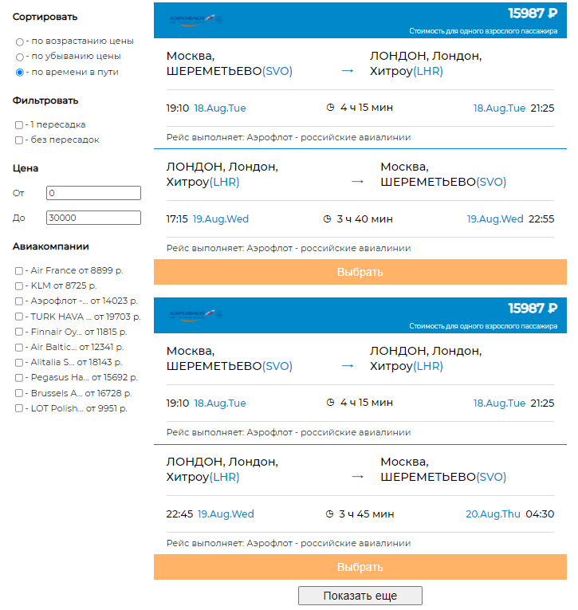

Использует **React**, **useReducer**, **useContext**, **SCSS**.

Реализует функционал приложения, которое получае данные со стороннего сервиса (в данном случае из файла json) и фильтрует - сортирует эти данные по определенным правилам.

Статус: разработка завершена. 

- [Структура](#Структура)
- [Получение данных](#Получение_данных)
- [Context и Store](#Context_и_Store)
- [alertContext](#Начальная_установка)

# Структура

Главная страница (Home) является контейнером, который содержит:

1. data. Модуль отвечающий за получение и адаптирование данных
2. Элементы управления. Они позволяют контролировать отрисовку необходимой информации. Размещаются в компонентах Carrier, Price, Sort, Transfer
3. context/control. Хранилище. В нем хранятся данные от элементов управления. На их основе будет происходить фильтрация и сортировка отображаемых данных. Именно отображаемых. Сами данные мутироваться не будут!
4. Элементы с отображением информации. Это список (компонент Cards) и каждый конкретный элемент информации (компонент Card)

Схема следующая: данные получены и сохранены в store; далее - изменение в одном из элементов управления (2) будет вызывать изменения в store (3), что, в свою очередь, будет отражаться элементами Card на главное странице (4)

# Получение данных

Разместим файл json в разделе public, что позволит обращаться к нему как './flights.json'. 

Вынесем fetch в отдельный модуль. Для удобства разработки учтем, что можно получать не все данные, а лишь несколько элементов (в параметрах фигурирует как limit). Ну а если ничего не указано (назовем это действием по умолчанию), тогда присвоим limit null. Этот параметр впоследствии попадет в функцию извлечения данных из адаптера. 
Далее - последовательно вызываем then:
1. Первым then вернем либо данные, либо ошибку. Это необходимо сделать, чтобы учесть всевозможные негативные ответы. Такие как 403 - запрет на просмотр страницы, 401 - ошибка авторизации, если бы она была, 404 - ресурс не найден, 502 - прокси не может получить ответ от сайта, 504 - слишком долгое ожидание. Если ошибку вызвать как Promise.reject(new Error), тогда ее можно будет в любом месте перехватить через catch. 
2. обрабатываем стрим-объект, преобразовывая его в текст формата json, который и возвращается в качестве промиса
3. вызываем искусственную задержку обработки, имитируя получение данных из сети. Т.к. в данном приложении мы работаем с файлом json и подобная функция необходима вместо throttling`a
4. runAdapter получает данные и число элементов, которые мы хотим отрисовать. Если ничего не указано, или указано число больше количества элементов данных, тогда обрисовываться будут все элементы. Ну а если указано какое-либо промежуточное число, тогда именно это количество и будет отрисовываться. Теперь можем преобразовать данные, адаптируя их для приложения (adaptFlightToClient).

Важно: все асинхронные операции должны происходить только в специальном для этого месте - useEffect. Итак, теперь данные можно было бы просто занести в локальный стейт как const [data, setData] = useState(), но в целях масштабирования приложения, адаптированные данные сохраняем в глобальный store.

*src/data/fetchData.js*

    const handleErrors = (response) => response.ok 
      ? Promise.resolve(response) 
      : Promise.reject(new Error(response.statusText));

    const json = (response) => response.json();

    const delay = (milliseconds) => new Promise((resolve) => setTimeout(resolve, milliseconds));

    const runAdapter = ({result: {flights}}, limit) => {
      const amountOfElements = ((limit === null) || (limit > flights.length)) ? limit = flights.length : limit;
      return adaptFlightToClient(flights, amountOfElements);
    };

    export const fetchServerData = async (limit = null) => (
      fetch('./flights.json', HTTP_HEADERS)
        .then(handleErrors)
        .then(json)
        .then(await delay(1000))
        .then((data) => runAdapter(data, limit))
    );

# Context и Store

Задача состоит в том, чтобы сохранить значения всех элементов управления (в дальнейшем - контролов) и на этой основе произвести вычисления. Это и определит структуру хранилища:

1. **Создаем базовую структуру**:

*src/context/control/ControlState.js*

    const initialState = {
      [ADAPTED_FLIGHTS]: [],
      [SORT]: {
        [ASCENDING]: {...},
        [DESCENDING]: {...},
        [TOTAL_TRAVEL_DURATION]: {...},
      },
      [FILTER_BY_TRANSFER]: {
        [ONE_BOARDING]: {...},
        [DIRECT]: {...},
      },
      [FILTER_BY_PRICE]: {
        [MIN_PRICE]: {...},
        [MAX_PRICE]: {...},
      },
      [FILTER_BY_CARRIER]: [],
    };

В ADAPTED_FLIGHTS будут изначально сохраняться адаптированные данные. В общем, логичнее было бы их вынести в отдельное хранилище. Но поскольку никаких изменений с этими данными производиться не будет, а эти данные понадобятся для манипуляций в ControlState, оставим в этом хранилище.

SORT, FILTER_BY_TRANSFER, FILTER_BY_PRICE - это радиобаттоны, чекбоксы и поля ввода, соответсвенно. Содержат те или иные данные для отрисовки компонентов (name, title) для манипуляции с ними (value, checked), или уже готовые функции сортировки (fn: (a, b) => (a.price - b.price))

FILTER_BY_CARRIER - это чекбокс. Заполняется динамически на основе полученных из данных с json файла.

2. **Создаем константы и экшены*:

Константы понадобятся, чтобы унифицировать данные в хранилище

*src/context/control/controlTypes.js*

    export const ADAPTED_FLIGHTS = `adaptedFlights`;

Экшены перечисляют все действия, которые мы будем совершать

*src/context/control/controlActions.js*

    export const CREATE_DATA_FLIGHTS = 'createDataFlights';
    export const UPDATE_SORT = 'updateSort';
    export const UPDATE_TRANSFER = 'updateTransfer';
    export const UPDATE_PRICE_RANGE = 'updatePriceRange';
    export const UPDATE_CARRIER = 'updateCarrier';

3. **Создаем редьюсер**:

Отправляя действия в редьюсер, мы можем воздействовать на стейт определенным образом. Существует несколько паттернов создания редьюсера. В данном случае воспользуемся литералами объекта:

*src/context/control/controlReducer.js*

    const handlers = {
      [CREATE_DATA_FLIGHTS]: (state, {payload: {flights, uniqueCarriers}}) => ({
        ...state, [ADAPTED_FLIGHTS]: flights, [FILTER_BY_CARRIER]: uniqueCarriers
      }),
      [UPDATE_SORT]: (state, {payload}) => ({
        ...state, [SORT]: payload
      }),
      [UPDATE_TRANSFER]: (state, {payload}) => ({
        ...state, [FILTER_BY_TRANSFER]: payload
      }),
      [UPDATE_PRICE_RANGE]: (state, {payload}) => ({
        ...state, [FILTER_BY_PRICE]: payload
      }),
      DEFAULT: state => state,
    };

    export const controlReducer = (state, action) => {
      const handle = handlers[action.type] || handlers.DEFAULT;
      return handle(state, action);
    };

4. **Извлекаем контекст**:

Именно этот инструмент предоставляет различным компонентам доступ к стейту user:

*src/context/user/controlContext.js*

    import {createContext} from "react";

    export const ControlContext = createContext();

5. **Создаем хранилище controlState**:

Ранее мы уже создали начальную базовую структуру initialState и правила по которым они будут изменяться (редьюсер). Остается только создать хранилище на этой основе:

*src/context/control/ControlState.js*

    import React, {useReducer} from 'react';

    const [state, dispatch] = useReducer(controlReducer, initialState);

Теперь мы можем извлекать значения хранилища и воздействовать на него посредством dispatch:

- Селекторы

Чтобы в контролах получить данные из хранилища, тут же создаем функции селекции при обращении к которым мы сможем получать необходимые части:

*src/context/control/ControlState.js*

    const getSortState = () => state[SORT];
    const getTransferState = () => state[FILTER_BY_TRANSFER];
    const getPriceRangeState = () => state[FILTER_BY_PRICE];
    const getCarrierState = () => state[FILTER_BY_CARRIER];

- Диспатчеры

Чтобы можно было в контролах воздействовать на хранилище, создаем диспатчи. По сути, это аналоги actionCreators, в которые мы передаем объекты (payload):

*src/context/control/ControlState.js*

    const updateSort = (payload) => {
      dispatch({type: UPDATE_SORT, payload});
    };

    const updateTransfer = (payload) => {
      dispatch({type: UPDATE_TRANSFER, payload});
    };

    const updatePriceRange = (payload) => {
      dispatch({type: UPDATE_PRICE_RANGE, payload});
    };

    const updateCarrier = (payload) => {
      dispatch({type: UPDATE_CARRIER, payload});
    };

    const createDataFlights = (flights) => {
      const uniqueCarriers = getUniqueCarriers(flights);
      dispatch({type: CREATE_DATA_FLIGHTS, payload: {flights, uniqueCarriers}});
    };

- Воздействие на отображаемые адаптированные данные

За это будет отвечать функция getProcessedData, которая последовательно извлекает оригинальные данные, фильтрует, сортирует их, а затем, в зависимости от необходимого количества переданного в аргументе limit, отправляет их на отрисовку (в компоненте Cards)

5. **Provider**:

Воспользуемся свойством context.Provider и паттерном children для того, чтобы все дочерние компоненты могли подписаться на изменения хранилища. В value передаем объектом все те функции, которые мы описали выше и, в том числе, можно передать все хранилище (controlState: state)

*src/context/control/ControlState.js*

    return (
      <ControlContext.Provider
        value={{
          updateSort,
          updateTransfer,
          updatePriceRange,
          updateCarrier,
          getSortState,
          getTransferState,
          getPriceRangeState,
          getCarrierState,
          getProcessedData,
          createDataFlights,
          controlState: state
          }} >
          {children}
      </ControlContext.Provider>
    );

6. **Оборачиваем все компоненты в UserState**. 

Тем самым абсолютно любые компоненты имеют доступ к стейту User при использовании его контекста.

*src/index.js*

    import React from 'react';
    import ReactDOM from 'react-dom';
    import App from './App';
    import './assets/scss/style.scss';
    import {ControlState} from './context/control/ControlState';

    ReactDOM.render(
      <React.StrictMode>
        <ControlState>
          <App />
        </ControlState>
      </React.StrictMode>,
      document.getElementById('root')
    );

7. **Использование хранилища в компонентах**.

Все, что нужно теперь для извлечения стейта, это использовать в виде

    const {getCarrierState, updateCarrier} = useContext(ControlContext);

*src/components/Carrier.jsx*

    import React, {useContext} from 'react';
    import {ControlContext} from '../../context/control/controlContext';

    const Carrier = () => {
      const {getCarrierState, updateCarrier} = useContext(ControlContext);

      const chooseByCarrier = getCarrierState();

      const handleChange = ({target: {name, checked}}) => {
        const payload = [...chooseByCarrier.map(item => item.name === name ? {...item, checked} : item)];
        updateCarrier(payload);
      };

      return (
        <section className="carrier">
          
Авиакомпании

          <ul>{
            chooseByCarrier.map(({name, checked, minPrice}) => (
              <li className="carrier__li" key={name}>
                <input
                  type="checkbox"
                  id={name}
                  name={name}
                  checked={checked}
                  onChange={handleChange}
                  className="carrier__checkbox" />
              </li>
            ))
          }</ul>
        </section>
      );
    };

    export default Carrier;

